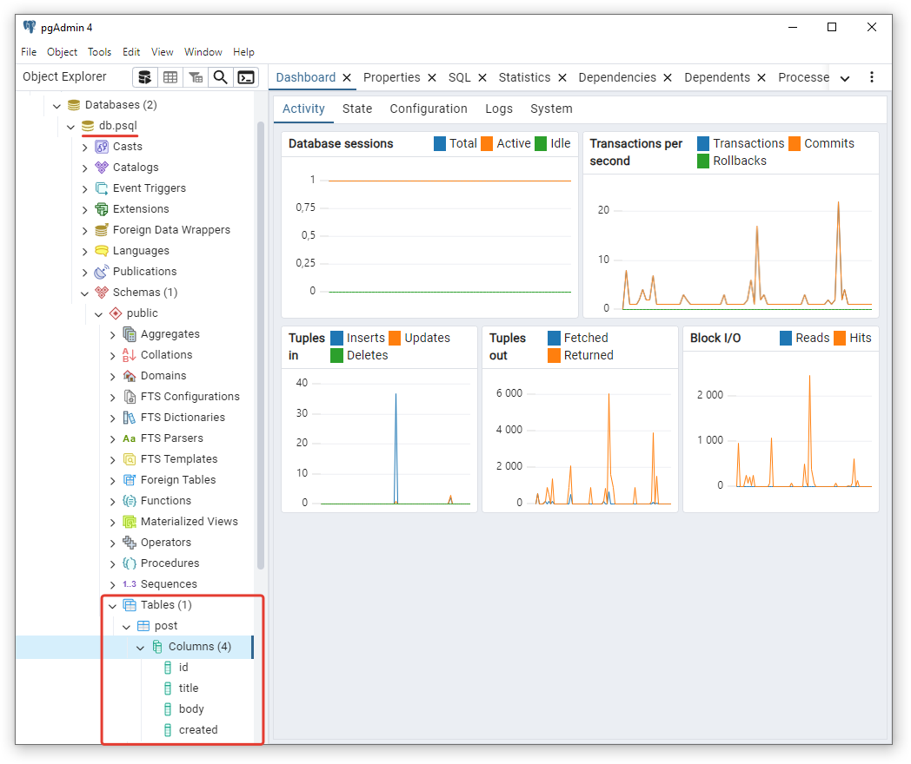
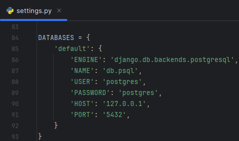
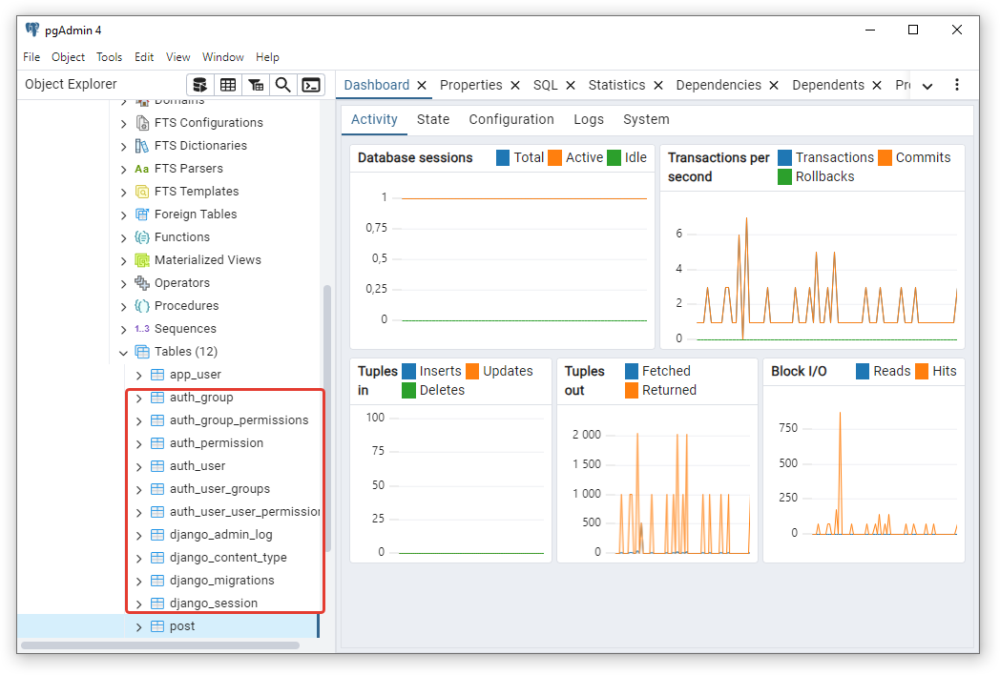
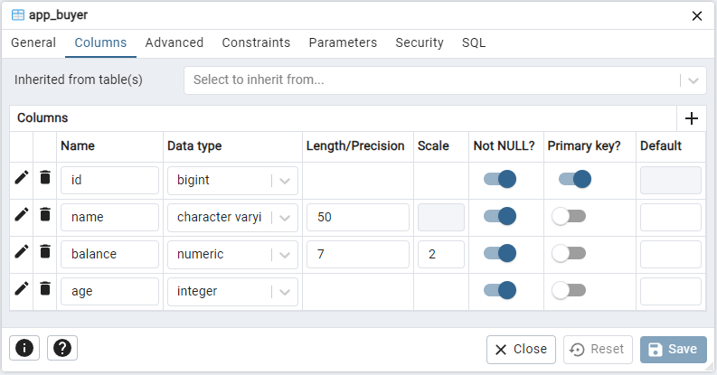
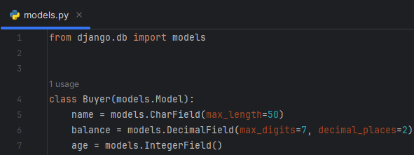
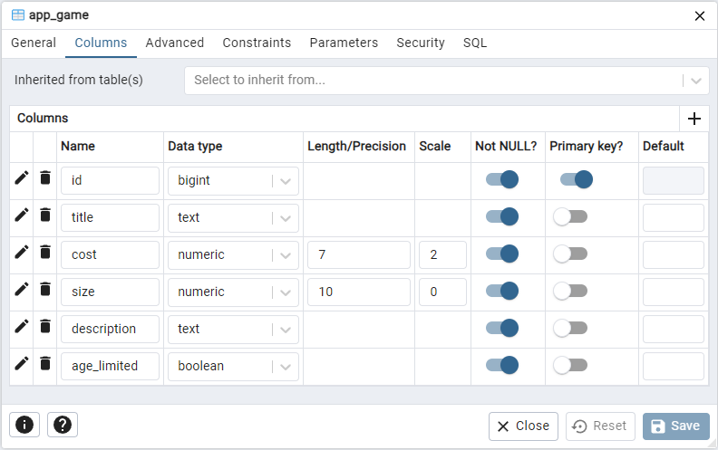
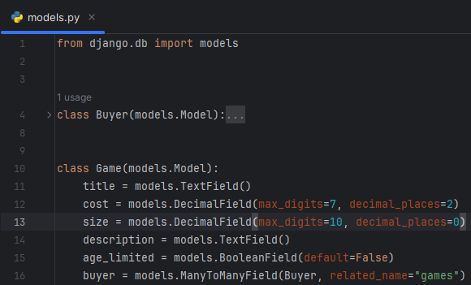

# Модуль №19. Django в Python. Дополнительный модуль.
## Домашнее задание по теме "Настраиваем СУБД postgre в Django"

### Что нужно сделать:

### 1. Старт работы с PostgreSQL.

Скачайте и установите официальный пакет `pgsql` для вашей ОС. Установите `PGadmin` и подключитесь к локальному серверу, создайте новую базу данных и прикрепите скриншот выполненного задания.



### 2. В своем Django проекте

**Установите драйвер** `psycopg2` для работы с базой `PGSQL` используя менеджер пакетов `pip`. В файле настроек проекта выполните подключение к базе данных:

```
DATABASES = {
    'default': {
        'ENGINE': 'django.db.backends.postgresql',
        'NAME': 'имя_базы_данных',
        'USER': 'имя_пользователя',
        'PASSWORD': 'пароль',
        'HOST': '127.0.0.1',
        'PORT': '5432',
    }
}
```



**Создайте и выполните** миграции используя `makemigrations` и `migrate`. Проверьте
подключение, в базе данных должны создаться технические таблицы `Django` проекта.

```bash
python manage.py makemigrations
python manage.py migrate
```



### 3. Перенесите любую созданную ранее модель базы данных в PGSQL.
Используйте `Django` модели и миграции. Создайте несколько таблиц через конструктор `PGadmin` и свяжите их с `Django` проектом, создав необходимые модели.





******





### 4. Используйте Django ORM для тестирования запросов в вашу базу данных.

Выполните команду `python manage.py shell`. Импортируйте необходимые модели из вашей базы данных и создайте не менее 4 запросов, например:
- запрос на получение всех объектов базы данных и конкретного по id.
- запрос на фильтрацию
- запрос на добавление или удаление объекта

Запрос на подсчет количества объектов `len()`, можно комбинировать с
фильтрацией.

```cmd
>>> from app.models import Buyer
>>> Buyer.objects.create(name="user 1", balance=100, age=25)
<Buyer: Buyer object (1)>
>>> Buyer.objects.create(name="user 2", balance=500, age=30)
<Buyer: Buyer object (2)>
>>> Buyer.objects.all()
<QuerySet [<Buyer: Buyer object (1)>, <Buyer: Buyer object (2)>]>
>>> Buyer.objects.filter(id=1)
<QuerySet [<Buyer: Buyer object (1)>]>
>>> Buyer.objects.get(id=2).delete()
(1, {'app.Buyer': 1})
>>
```

Done!
